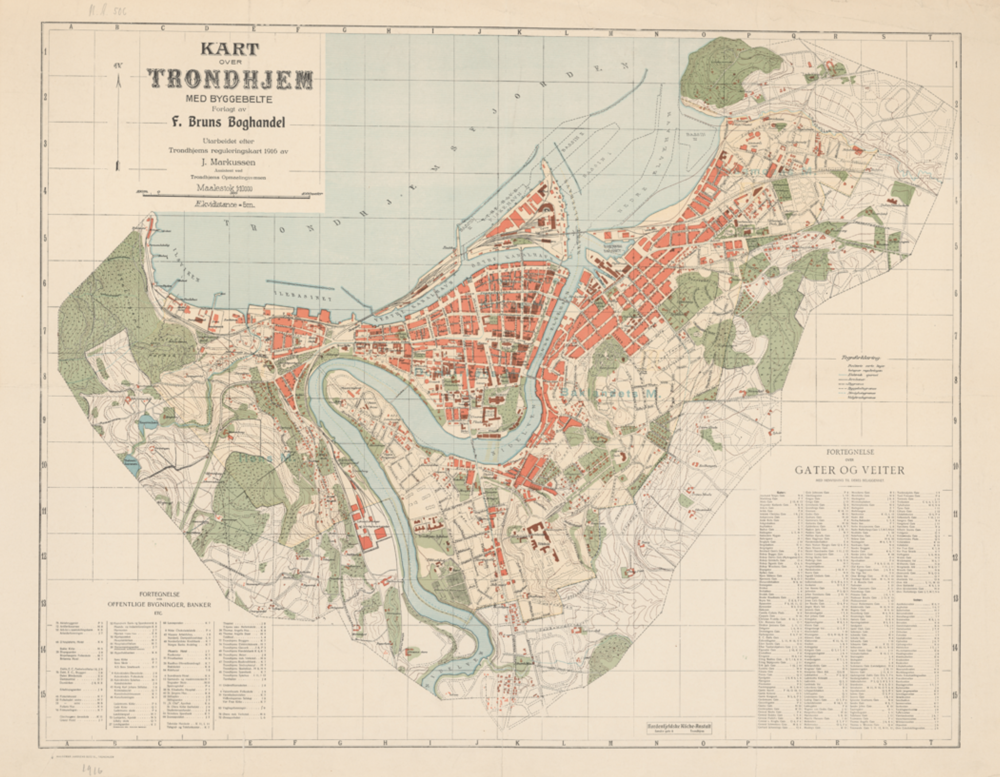
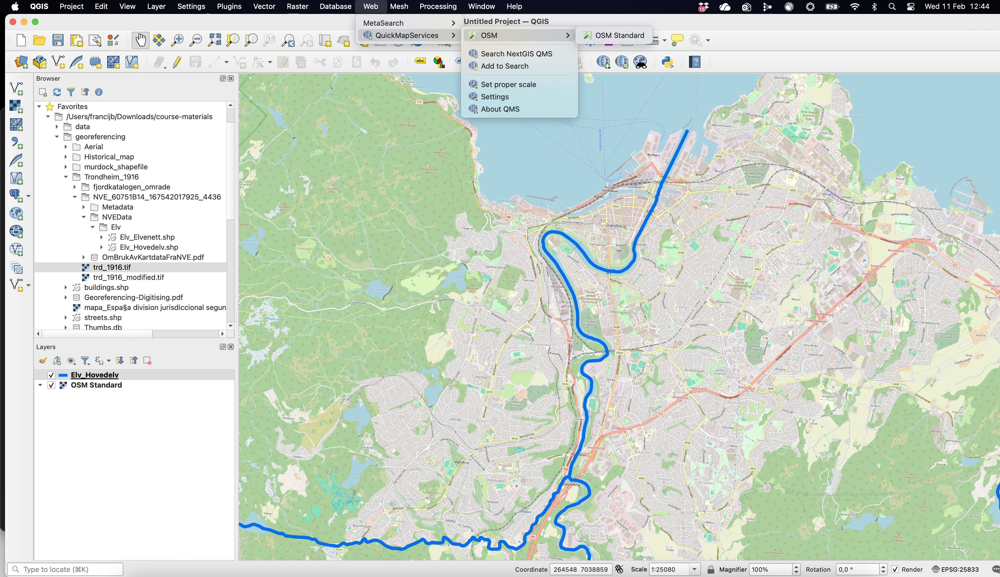
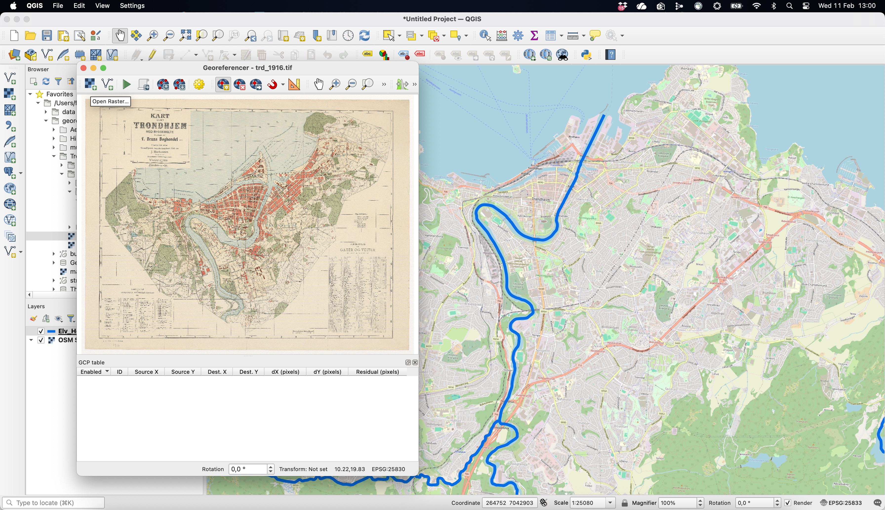
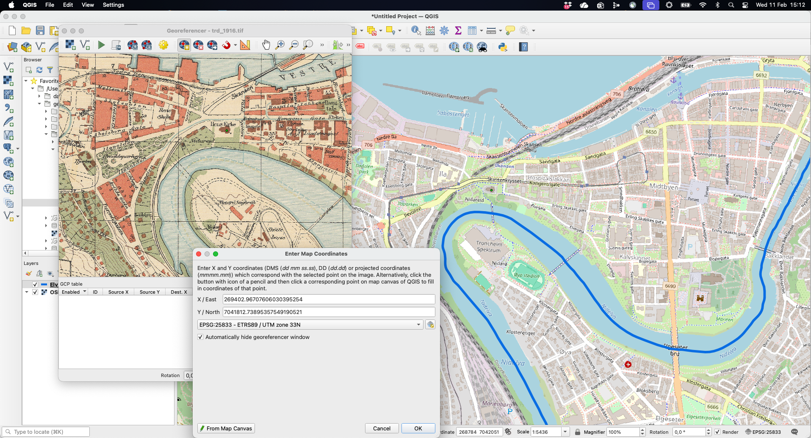
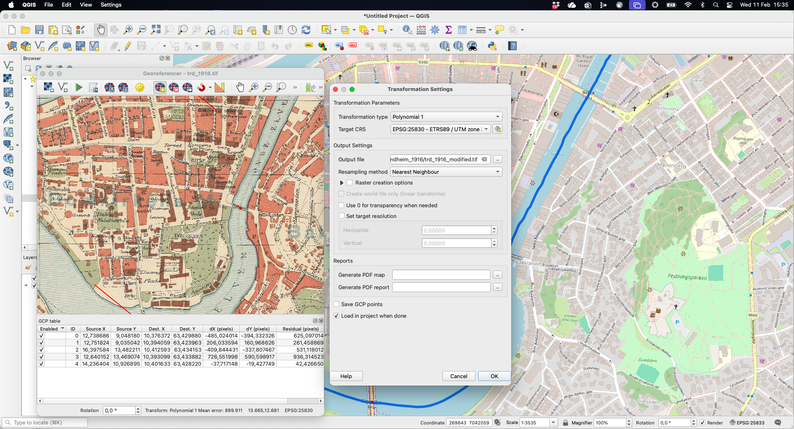
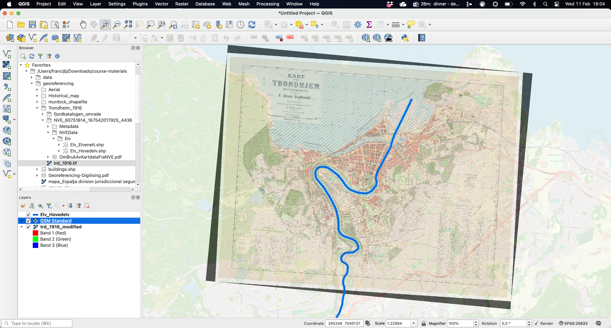
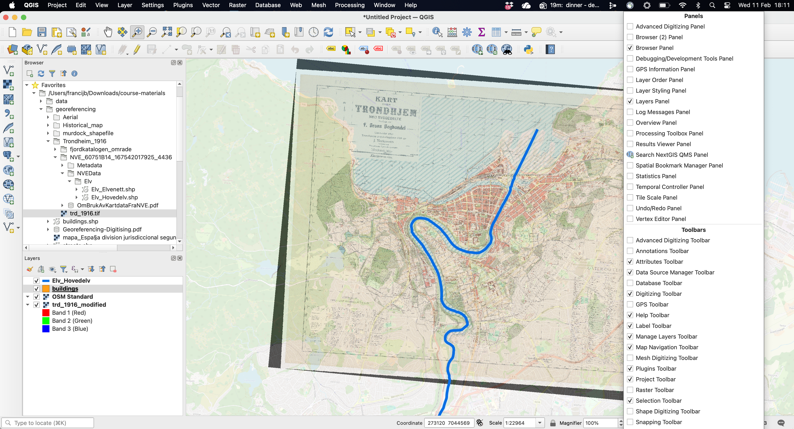
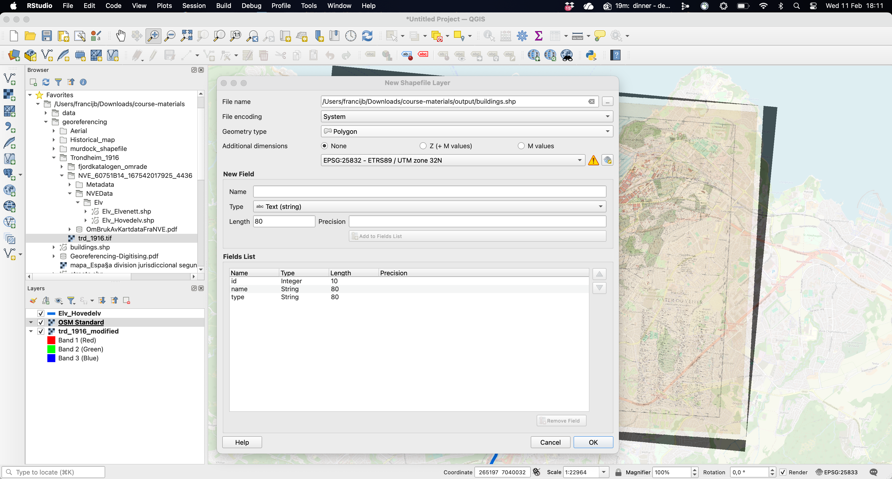
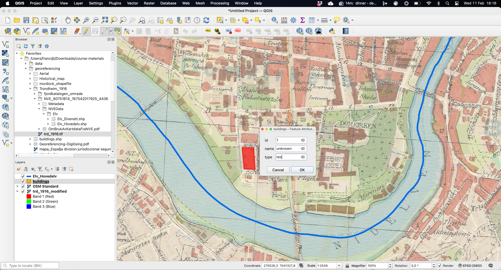
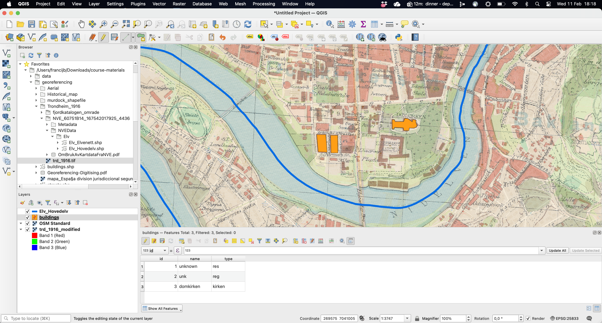

Creating spatial objects (shapefiles) from old maps, aerial pictures or satellite images involves two steps: (1) geo-referencing the image itself, that is, adding real-world spatial coordinates to the image, and (2) digitising the spatial features you are interested in using dots, lines or polygons (creating a shapefile). 

Although this process can be done using R, it is more intuitive using specific GIS software such as [QGIS](https://qgis.org) or [ArcGIS](https://arcgis.com/index.html). The [Programming Historian](https://programminghistorian.org/en/lessons/vector-layers-qgis) and the [Geospatial Historian](https://geospatialhistorian.wordpress.com) offer great tutorials both in QGIS and ArcGIS [@clifford2013; see also @gregory2007]. Manually digitising points, lines or polygons is time-consuming. Recent advances in computational methods enable automatically extracting digital versions from scanned images of historical maps, aerial photos or satellite images. You can find more details in @hosseini2021, @combes2022, @litvine2024, or @mcdonough2024.

Here, we will be using **QGIS**, a geographic information system (GIS) software, which is free and open-source. This type of GIS application consists of a graphical user interface that can be manipulated using menus and toolbars, as well as dragging shape or raster files into the main window. It is therefore a more intuitive way of interacting with spatial object. You can find the instructions to download and install QGIS [here](https://www.qgis.org).

In this session, we will digitise the buildings contained in this map of Trondheim from 1916 (you have it in the course materials). 

::: {.figure-content} 
{width="100%" height="100%" fig-align="center"}
:::

### Geo-referencing images

The first step involves adding real-world spatial coordinates to the image. We will do it step by step.

Firstly, import the reference layer that will help us geo-referencing the image. This layer can be an existing shapefile containing some features that are easily recognizable (e.g. rivers, boundaries, etc.) or a general base map. Here, we can use the shapefile "Elv_Hovedelv.shp", which is part of the course materials, and/or a base map. The latter can be access through the menu *Web* / *QMS* / *OSM* / *OSM Standard* (you will need to first install the corresponding plugin: *Plugins* / *Manage and Install Plugins*).^[Find and Install the *QuickMapServices*. Once installed, it will be available in the menu *Web* as mentioned in the main text. There are other base maps available that you could use.] The figure below shows both in the area around Trondheim: the thick blue line represents the main rivers contained in the shapefile and the rest is the *OSM Standard* base map. 

::: {.figure-content} 
{width="100%" height="100%" fig-align="center"}
:::

Once you have the reference layers in place, open *Georeferencer* tool. You can find it in the *Layer* menu at the top (or in *Raster* menu in previous QGIS versions). The *Georeferencer* window will pop up, where you can *Open raster*: this refers to the scanned image you want to geo-reference, here the old map of Trondheim.

::: {.figure-content} 
{width="100%" height="100%" fig-align="center"}
:::

The next step involves the actual process of geo-referencing, that is, providing real spatial coordinates to a regular image. This involves using the reference layers (e.g. the rivers or the base map) to provide the GIS software with the spatial coordinates where the image should be placed in space. In practical terms, this implies clicking *Find/add Ground Control Points* (GCPs), either as coordinates or, more conveniently, *From Map Canvas*, that is linking them to landmarks in the reference layer. Notice, that we first click on the scanned map. This opens up a window to *Enter Map Coordinates* (notice that this might often be hidden). After indicating that you are using the map canvas to provide the spatial coordinates, you do so by clicking in the appropriate location. Do not forget to click "OK": coordinates will then populate the corresponding. Window.

::: {.figure-content} 
{width="100%" height="100%" fig-align="center"}
:::

Repeat this process at least 3/4 times to better anchor the image where it should be. Old maps can be heavily distorted in many ways, so the more CGPs, the better. You should also open the *Transformations settings* to define the parameters that will guide geo-referencing the image to its hypothetical location. As shown below, this implies setting a few things. Firstly, you need to indicate which algorithm will be applied to process the geometric transformation function to map coordinates from the image space into real-world coordinates: linear or polynomial.^[The number of ground control points (GCPs) you need depends directly on the number of parameters in the transformation model you choose. A higher-order polynomial needs more GCPs, which helps modelling more distorted images (old maps). This kind of flexibility is not always better and a polynomial 1 with 3 control points might be good enough if the cartographic image is sufficiently precised (more complex transformations may overfit local noise).] Secondly, you have to set the Coordinate Reference System (CRS) that will be define the spatial properties attached to the image. A quick google search indicates that the proper one for Trondheim is "ETRS89-NOR / UTM zone 32N" (EPSG:25832), so we choose that one. Lastly, this process will create a new file, so make sure to select the folder you want to save it to.

::: {.figure-content} 
{width="100%" height="100%" fig-align="center"}
:::

Once you have defined the *Transformation settings* and finished adding CGPs to the scanned map, you can click *Start Georeferencing*. This will apply the geometric transformation and locate the image into the hypothetic location in real-world coordinates based on the input provided in the previous step. As mentioned above, the output will be a new version of the raw file. You can check whether the georeferencing is actually a good match by comparing it to the reference layers. This is easier if you can set the transparency of the other layers (and/or the order of the layers) to check how the results look like, that is, whether the image overlaps with the layers. Below, you can see the one created for this example, which does a relatively a good job. 

::: {.figure-content} 
{width="100%" height="100%" fig-align="center"}
:::

### Digitising spatial features

Once we have the image geo-referenced, we can use it to digitase the features we are interested in, regardless they are buildings, roads, forest area, etc. 

First, make sure that the *Digitizing toolbar* is enabled. Right-click on the toolbar to have access to all the tools that are available, so you can activate it. Given that the reference layers we used in the previous step (e.g. the river and the OSM base map) are no longer necessary we can remove it from the layer panel, so everything is a bit tidyier.

::: {.figure-content} 
{width="100%" height="100%" fig-align="center"}
:::

Secondly, create a *New Shapefile layer*. Clicking in the corresponding icon will open up a new window where you can define how this spatial object will look like. Make sure that you name appropriately and store it in a particular folder, define its type, either points, lines or polygons and set an adequate Coordinate Reference System (CRS). Here, we will be naming this layer "buildings", store it in one of the folders within the "course-material", indicate that it is a polygon shapefile and set the CRS to the one most adequate for the Trondheim area (see above). By default, this layer will have one field (column) named *id* where you will be able to identify the features you will be digitising (buildings). Feel free to add more fields, either qualitative or numerical, if you think is necessary (*name*, *type*, etc.).^[Do not forget to click "Add to field list" to confirm this. This is in any case the type of information you will have somewhere else and that you will want to match with the shapefile you are creating.]

::: {.figure-content} 
{width="100%" height="100%" fig-align="center"}
:::

You are now read to start creating your polygons (or dots or lines depending on the type of shapefile you are creating). In order to do so, click "Toggle editing" (the pencil icon) plus "Add polygon feature". This will allow you to draw each vertex by left-clicking. You will see how you polygon is forming as you keep adding vertices. When you are don, right-click to finish. This will open up a new window where you can fill in the feature attributes that help defining each of the features you will be creating (*id*, *name*, etc.).

::: {.figure-content} 
{width="100%" height="100%" fig-align="center"}
:::

Now you have successfully created the first feature. Repeat the process as many times as you wish, basically until you digitise all the features you are interested in. Here we only create three polygons for illustrative purposes. As you will notice, everytime you add a new polygon, the *attribute table* gets updated with a new row (your observations).

::: {.figure-content} 
{width="100%" height="100%" fig-align="center"}
:::

And that's it. Make sure you "Save layer edits", so your finalised creating the spatial object which will be saved in your working directory and will be available for your next steps in the research proces. You can obviously save your work, your shapefile, and continue editing it at a later point.

This all refers to creating shapefiles from scratch. You can also rely on existing shapefiles and edit them accordingly to your needs. There are probably a contemporary shapefile with all the buildings in Trondheim. You could start with that one and use the historical map to delete and/or modify the features (buildings) that do not conform with what the 1916 map indicates. The *Advanced Digitizing Toolbar* will allow you to perform different tricks, such as splitting or merging existing polygons.

